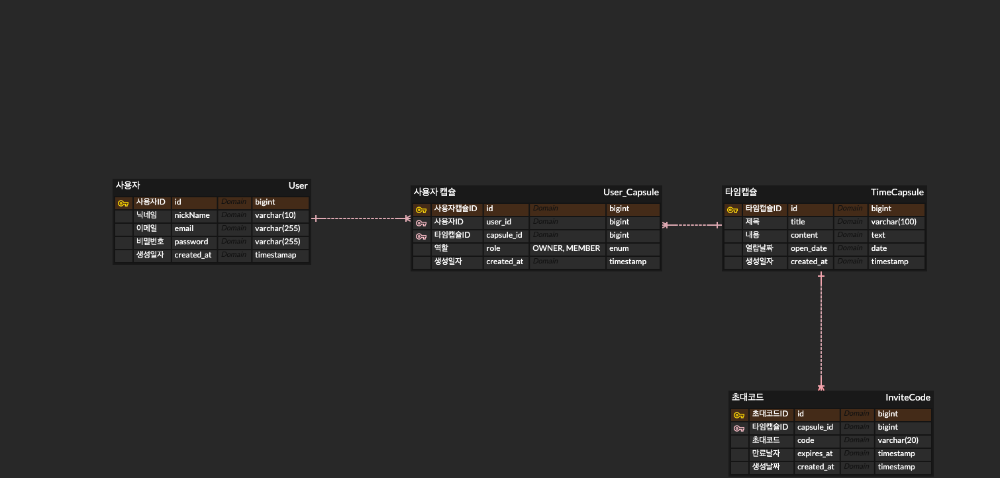

## MementoCaps
## 0. 인프런 워밍업 스터디
1. 미션1 (깃허브 리포지토리에 프로젝트 올리기) - [미션1 commit](https://github.com/bangtori/MementoCaps/commit/588df081eaba906b24d0d68896a6d7c7e4ecc135)
2. 미션2 (테이블 설계하기) - [미션2 commit](https://github.com/bangtori/MementoCaps/commit/d6212fff10a175fe9721ed6332a4f8465ac68054)
3. 미션3 (REST API 설계하기)
4. 미션4 (조회 REST API 만들기)
5. 미션5 (삽입, 삭제, 수정 REST API 만들기)
6. 미션6 -> 포트폴리오 프로젝트 (가상 프로필을 나의 프로필로 바꾸기)
7. 미션7 (배포한 프로젝트 공유하기)

### Troubleshooting
| 제목  | 미션 | 링크                                                  |
|-----|----|-----------------------------------------------------|
| 템플릿 | -  | [트러블슈팅폴더 내 파일](./Troubleshooting_Docs/Example01.md) |


---

## 1. 개요
### 📌 프로젝트 소개
디지털 타임캡슐은 사용자가 미래의 자신 또는 특정한 사람에게 메시지를 남기고, 지정한 날짜에만 열어볼 수 있도록 하는 웹 서비스입니다.

### 💡 개발 동기
최근 몇 년 동안 크리스마스나 연말연시처럼 특정한 날에만 메시지를 열어볼 수 있는 서비스가 유행했습니다. 이러한 서비스가 인기를 끈 이유는 **"기대감과 설렘을 유도하는 시간 제한 콘텐츠"** 가 사람들의 심리를 자극하기 때문입니다.
<br>이러한 콘텐츠는 **기대감을 높이고, 특별한 순간을 더욱 의미 있게 만들며, 감성적인 몰입도를 증가시키는 효과**를 가집니다.

사실 이러한 개념은 오래전부터 존재해왔습니다. **과거에도 우리는 타임캡슐을 통해 미래의 자신에게 편지를 보내거나 추억을 기록하는 경험을 해왔습니다.
<br>** 하지만 아날로그 방식의 타임캡슐은 **보관이 어렵고, 분실될 위험이 크며, 관리가 불편하다는 문제점**이 있었습니다.

또한, 친구들에게 편지를 받는 서비스와 달리, **타임캡슐은 "미래의 우리" "미래의 나"에게 보내는 편지라는 점에서 메시지를 보내는 사람에 자신이 포함되어 있음에 초점을 맞추고 있습니다.** 사용자는 과거의 자신이 남긴 메시지를 통해 현재의 자신을 되돌아볼 수 있으며, 이를 통해 동기 부여 및 자기 성찰의 기회를 가질 수 있습니다.


따라서 이러한 **전통적인 타임캡슐의 경험을 디지털화하여, 보다 쉽고 안전하게 미래의 자신과 소통할 수 있는 서비스**를 만들고자 했습니다.

## 2-1. 프로젝트 기능
1. **회원가입 / 로그인**
    - 이메일 + 비밀번호 로그인
2. **타임캡슐 생성**
    - 제목 입력
    - 내용 입력 (텍스트 / 이미지 / 영상 업로드)
    - 열리는 날짜 선택

3. **타임캡슐 조회 & 열기**
    - 설정된 날짜 도달 시 타임캡슐 열기 가능

4. **타임캡슐 관리 & 초대 기능
    - 내가 만든 타임캡슐 목록 조회
    - 초대 코드 입력 후 타임캡슐 참여 가능
    - 타임캡슐에 공동 작성자 추가 가능 -> 초대코드 생성 기능
    - 개별 타임캡슐 클릭 → 상세 내용 보기
    - 타임캡슐 삭제 가능

## 2-2. 추가 기능
미션 이후 추가 계획 기능
1. 타임캡슐 공개 기능
    - 작성 시 공개 / 비공개 선택
    - 공개 타임캡슐 페이지에서 공개 타임캡슐 확인 가능
2. 공개 타임캡슐
    - 좋아요 기능
    - 최신순 / 인기순(좋아요 순) 정렬
3. 초대 관리 기능
    - 초대 승인 기능
    - 참여한 사용자 방출 기능
4. 타임캡슐 열림 알림
    - 이메일 혹은 푸쉬를 통한 알림

## 3. 데이터 모델


<details>
<summary>텍스트로 보기</summary>
<div markdown="1">

```
User (사용자)
- id (PK)
- nickName
- email
- password
- created_at

TimeCapsule (타임캡슐)
- id (PK)
- title
- content 
- open_date (타임캡슐 열리는 날짜)
- created_at

User_Capsule (사용자-타임캡슐 관계 테이블)
- id (PK)
- user_id (FK)  # N:M 관계
- capsule_id (FK)  # N:M 관계
- role (OWNER / MEMBER)
- created_at

InviteCode (초대 코드)
- id (PK)
- capsule_id (FK)
- code (랜덤 초대 코드)
- expires_at (유효 기간)
- created_at
```
</div>
</details>

## 3. API 설계
[자세한 명세서 확인(포스트맨)](https://documenter.getpostman.com/view/20884237/2sAYk7TQQs)
### 3.1 사용자 API
| 메서드    | 엔드포인트          | 설명   | 
| ------ | -------------- | ---- | 
| `POST` | `/auth/signup` | 회원가입 |
| `POST` | `/auth/login`  | 로그인  |
### 3.2 타임캡슐 API
| 메서드    | 엔드포인트                     | 설명   | 
|--------|---------------------------| ---- | 
| `POST` | `/capsules`               | 타임캡슐 생성 |
| `GET` | `/capsules/list/{userId}` | 내가 속한 타임캡슐 리스트 생성|
| `GET` | `/capsules/{capsuleId}` | 특정 타임캡슐 1개 조회 |
| `DELETE` | `/capsules/{capsuleId}` | 특정 타임캡슐 삭제 |

### 3.3 초대 및 참여 API 
| 메서드    | 엔드포인트                          | 설명   | 
|--------|--------------------------------| ---- | 
| `POST` | `/capsules/join`               | 초대코드 입력 후 참여 |
| `POST` | `/capsules/{capsuleId}/invite` | 초대 코드 생성|
